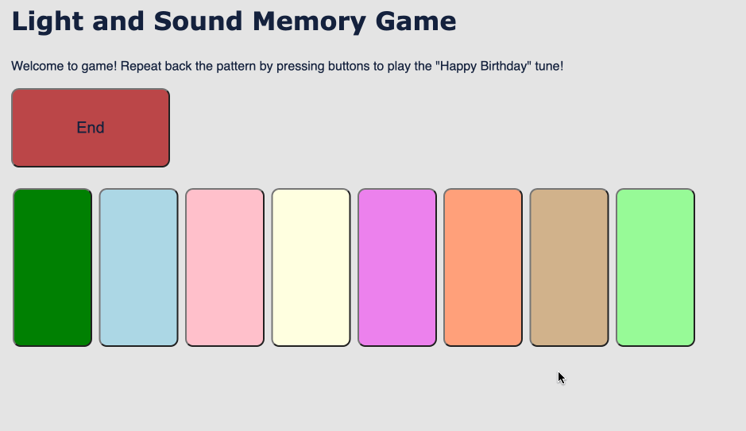

# Pre-work - *Memory Game*

**Memory Game** is a Light & Sound Memory game to apply for CodePath's SITE Program. 

Submitted by: **Saleheddine Bedoui**

Time spent: **5** hours spent in total

Link to project: https://glitch.com/edit/#!/salah-light-and-sound-memory-game

## Required Functionality

The following **required** functionality is complete:

* [x] Game interface has a heading (h1 tag), a line of body text (p tag), and four buttons that match the demo app
* [x] "Start" button toggles between "Start" and "Stop" when clicked. 
* [x] Game buttons each light up and play a sound when clicked. 
* [x] Computer plays back sequence of clues including sound and visual cue for each button
* [x] Play progresses to the next turn (the user gets the next step in the pattern) after a correct guess. 
* [x] User wins the game after guessing a complete pattern
* [x] User loses the game after an incorrect guess

The following **optional** features are implemented:

* [x] Any HTML page elements (including game buttons) has been styled differently than in the tutorial
* [x] Buttons use a pitch (frequency) other than the ones in the tutorial
* [x] More than 4 functional game buttons
* [x] Playback speeds up on each turn
* [ ] Computer picks a different pattern each time the game is played
* [ ] Player only loses after 3 mistakes (instead of on the first mistake)
* [ ] Game button appearance change goes beyond color (e.g. add an image)
* [ ] Game button sound is more complex than a single tone (e.g. an audio file, a chord, a sequence of multiple tones)
* [ ] User has a limited amount of time to enter their guess on each turn

The following **additional** features are implemented:

- [ ] List anything else that you can get done to improve the app!

## Video Walkthrough (GIF)

If you recorded multiple GIFs for all the implemented features, you can add them here:  

Click the start button to start playing.
If your guess is wrong you lose the game
.   

You have to get all correct guesses to win the game
.   

Here's a much shorter preview towards the end of the game

## Reflection Questions
1. If you used any outside resources to help complete your submission (websites, books, people, etc) list them here. 
To complete this project I used the provided CSS color codes link from the tutorial and another website (https://coolors.co/) to generate additional colors. I also used this link (https://pages.mtu.edu/~suits/notefreqs.html) to get the frequencies for the different buttons' sounds.  
My understanding of HTML, CSS and JavaScript basics comes from Colt Steele's Udemy Intro to web development course. Although I have not used it to finish this project, I beleive having gone through the foundations of web development helped move faster with this project all while understanding what I was doing, not only copy/pasting from the tutorial.

2. What was a challenge you encountered in creating this submission (be specific)? How did you overcome it? (recommended 200 - 400 words) 
Overall, working on this project went smooth. The tutorial breaks down the requirements in a very clear way. However, as a beginner, I tend sometimes to get excited and immersed into writing code that I may miss something critical. In this case, when I finished the tutorial and tried to run the game from start to finish, everything was ok except that the hints were not playing. I went back to my code and did a full review, focusing first on the playSingleClue and playClueSequence functions. I reviewed the tutorial step by step and found the problem: I did not call playClueSequence() in the startGame function.

3. What questions about web development do you have after completing your submission? (recommended 100 - 300 words) 
After completing this submission, a few questions come to my mind: This project was based on a step-by-step tutorial. How the process look like in industry real-life situations. I explored in school SDLC and the design process and I always wondered, how would these different tasks be divided in practice. Should a developer be involved in styling a web application or their job is purely executing designers' ideas and visions? With the ever growing pace of  new technologies appearing and developing, for a beginner like me, how can you find the right balance between learning the basics and building solid foundations while at the same time trying to keep up with everything new in the field?

4. If you had a few more hours to work on this project, what would you spend them doing (for example: refactoring certain functions, adding additional features, etc). Be specific. (recommended 100 - 300 words) 
If I had more time to work on this project, I would spend it turning the game into some sort of Piano fun tutorial. This will involve adding more buttons (to have at least 13 for a full octave) and style them in white and black and arrange them to look as a piano keyboard. Then, I would create a bunch of arrays, each representing a simple well-known tune. The application can select randomly a tune from the available ones, or the full list can be displayed for the user to choose from. At this beginner stage, we are not accounting for different sounds' (or notes) duration. For a specific predetermined tune, we can hard code sound durations into the playClueSequence function. But that would limit it to one single tune. For multiple tunes, probably an array is not the best way to store our tunes. A key-value pair data structure may be best suited and will allow us to store a duration parameter for each sound.

## Interview Recording URL Link

[My 5-minute Interview Recording](your-link-here)

## License

    Copyright [Saleheddine Bedoui]

    Licensed under the Apache License, Version 2.0 (the "License");
    you may not use this file except in compliance with the License.
    You may obtain a copy of the License at

        http://www.apache.org/licenses/LICENSE-2.0

    Unless required by applicable law or agreed to in writing, software
    distributed under the License is distributed on an "AS IS" BASIS,
    WITHOUT WARRANTIES OR CONDITIONS OF ANY KIND, either express or implied.
    See the License for the specific language governing permissions and
    limitations under the License.
